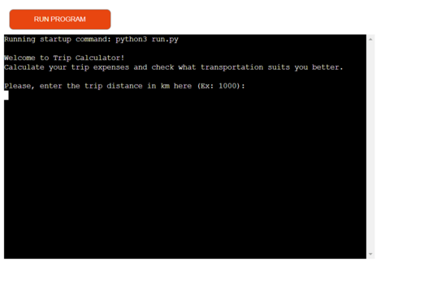
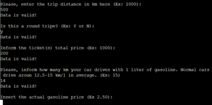
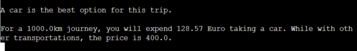

# __Trip Calculator__

Trip Calculator is an application built to allow users calculate the expenses of traveling by car or other ways.

Users must insert data such as total travel distance, how much they would spend on tickets, car consumption and gas price. With data the app will return which option is cheaper.

----

## __How to use it__

First the user needs to insert the total traveling distance. After that, they will be asked if it is a round way trip. If the user answers yes, the traveling distance and prices will be automatically doubled. Then, the user is asked for the ticket price, how much would they spend with planes, trains, busses tickets or so. The user now has to inform his car fuel consumption and the fuel price. With all that information, the app will give a result of how much would you spend with both kind of transportation.

## __Features__

### __Existing Features__

- __Input Area__

    - The app collects 5 different inputs from the user:
        - Total distance
        - Round way or one way trip
        - Tickets price
        - Fuel consumption
        - Fuel price 

- __Input Validator__

    - There are validators built within the app that will validate the users input and returns a message in case of a non-accepted input. 
    

- __TripCalculator Class__

    - A class was built to execute the final calculation of the app. In this way the application can be easily accessed in future projects. 

- __Main Block__

    - A main block was built to execute all the functions and modules necessary for the application to work.

----

## __Flow Chart__

- Total distance input
    - Validate input
- Journey type input
    - Validate input
- Ticket price input
    - Validate input
- Fuel consumption input
    - Validate input
- Fuel price
    - Validate input
- Best option output
- Final result analysis

----

## __Technologies__
- Git (Gitpod and Github)
- Python
- Heroku

## __Data Model__

On this application, everything happens inside the main block. All the inputs, inserted by the user. are stored into variable inside the Main function.

A class was built to handle the final calculation that is made on the application.

----

  ## __Testing__

The website was manually tested, in the following way:
- Code passed through a PEP8 linter and confirmed no problems
- Tested in local and Code Institute Heroku terminal.

- For Testing:
 - Every time a input is inserted, it has to show a message: Data is Valid.
 - If the input is a letter where a number should be, the opposite, a space typing or an empty value, an error will appear on console.
----

## __Deployment__

This project was deployed using Code Institute's mock terminal for Heroku.

### [Heroku live link](https://journey-calculator.herokuapp.com/)

### [GitHub Repository](https://github.com/Vepp1/trip-calculator)
----

## __Credits__

### __Content__ 

- Code Institute for the deployment terminal.